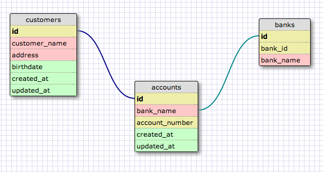

# U3.W7: Designing Schemas


#### I worked on this challenge [by myself, with: ]


## Release 0: Student Roster Schema
<!-- display your image inline here -->


## Release 1: One to Many Schema
<!-- display your image inline here -->


## Release 2: One to One Schema
<!-- display your image inline here -->


## Release 3: Many to Many Schema
<!-- display your image inline here -->


## Release 4: Design your own Schema
Description of what you're modeling:

####*app/models/customer.rb*
```
#Customer can have many accounts

class Customer < ActiveRecord::Base
  has_many :accounts
  
end

```

####*app/models/account.rb*

```
#account belongs to one user
#account has one user
#account has one bank

class Account < ActiveRecord::Base
  has_and_belongs_to_one :user
  has_one :bank
  
end
```

####*app/models/bank.rb*

```
#Bank has many accounts

class Bank < ActiveRecord::Base
  has_many :accounts

end

```



<!-- display your one-to-one image inline here -->
<!-- display your many-to-many image inline here -->

## Release 5: Reflection
This exercise was really fun, learned many things about schema and ActiveRecord, belongs_to, has_one and has_many relationships.
