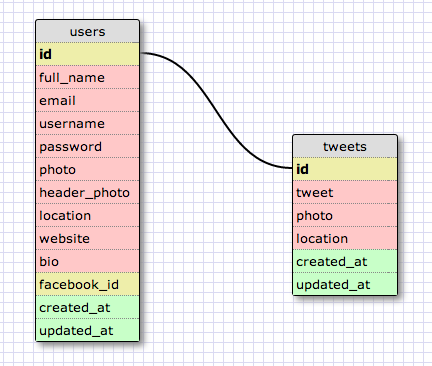

# U3.W7: Modeling a Real-World Database (SOLO CHALLENGE)

## Release 0: Users Fields
<!-- Identify the fields Twitter collects data for -->
```
+------------+
| users      |
+------------+
| id         |
| full_name  |
| email      |
| username   |
| password   |
| photo      |
| header_pic |
| location   |
| website    |
| bio        |
| facebook_id|
+------------+
```

## Release 1: Tweet Fields
<!-- Identify the fields Twitter uses to represent/display a tweet. What are you required or allowed to enter? -->

```
+------------+
| tweets     |
+------------+
| id         |
| tweet_id   |
| tweet      |
| photo      |
| location   |
+------------+
```

## Release 2: Explain the relationship
The relationship between `users` and `tweets` is: 
<!-- because... -->
```
class User
	has_many :tweets
end
```

```
class Tweets
	belongs_to :user
	has_one :user
	#Which could be written as
	# has_and_belongs_to_one :user
end

```
> User has many tweets (because user will have many tweets, duh!)
> Tweet belongs to a user
> Tweet has one user

## Release 3: Schema Design
<!-- Include your image (inline) of your schema -->


## Release 4: SQL Statements
<!-- Include your SQL Statements. How can you make markdown files show blocks of code? -->

```


-- ---
-- Globals
-- ---

-- SET SQL_MODE="NO_AUTO_VALUE_ON_ZERO";
-- SET FOREIGN_KEY_CHECKS=0;

-- ---
-- Table 'users'
-- 
-- ---

DROP TABLE IF EXISTS `users`;

CREATE TABLE `users` (
  `id` INTEGER NULL AUTO_INCREMENT DEFAULT NULL,
  `full_name` MEDIUMTEXT NULL DEFAULT NULL,
  `email` MEDIUMTEXT NULL DEFAULT NULL,
  `username` MEDIUMTEXT NULL DEFAULT NULL,
  `password` MEDIUMTEXT NULL DEFAULT NULL,
  `photo` MEDIUMTEXT NULL DEFAULT NULL,
  `header_photo` MEDIUMTEXT NULL DEFAULT NULL,
  `location` MEDIUMTEXT NULL DEFAULT NULL,
  `website` MEDIUMTEXT NULL DEFAULT NULL,
  `bio` MEDIUMTEXT NULL DEFAULT NULL,
  `facebook_id` MEDIUMTEXT NULL DEFAULT NULL,
  `created_at` DATETIME NULL DEFAULT NULL,
  `updated_at` DATETIME NULL DEFAULT NULL,
  PRIMARY KEY (`id`)
);

-- ---
-- Table 'tweets'
-- 
-- ---

DROP TABLE IF EXISTS `tweets`;

CREATE TABLE `tweets` (
  `id` INTEGER NULL AUTO_INCREMENT DEFAULT NULL,
  `tweet` MEDIUMTEXT NULL DEFAULT NULL,
  `photo` MEDIUMTEXT NULL DEFAULT NULL,
  `location` MEDIUMTEXT NULL DEFAULT NULL,
  `created_at` DATETIME NULL DEFAULT NULL,
  `updated_at` DATETIME NULL DEFAULT NULL,
  PRIMARY KEY (`id`)
);

-- ---
-- Foreign Keys
-- ---

ALTER TABLE `tweets` ADD FOREIGN KEY (id) REFERENCES `users` (`id`);

-- ---
-- Table Properties
-- ---

-- ALTER TABLE `users` ENGINE=InnoDB DEFAULT CHARSET=utf8 COLLATE=utf8_bin;
-- ALTER TABLE `tweets` ENGINE=InnoDB DEFAULT CHARSET=utf8 COLLATE=utf8_bin;

-- ---
-- Test Data
-- ---

-- INSERT INTO `users` (`id`,`full_name`,`email`,`username`,`password`,`photo`,`header_photo`,`location`,`website`,`bio`,`facebook_id`,`created_at`,`updated_at`) VALUES
-- ('','','','','','','','','','','','','');
-- INSERT INTO `tweets` (`id`,`tweet`,`photo`,`location`,`created_at`,`updated_at`) VALUES
-- ('','','','','','');


```

## Release 5: Reflection
<!-- Be sure to add your reflection here!!! -->
I exercise is not that bad. I do know how/when to define the one_to_one, one_to_many and belongs_to relationships on models, but GUI representation confuses me more, with foreign key and etc etc.