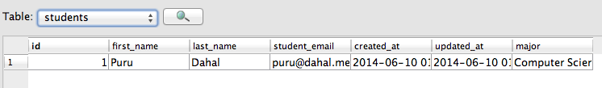

# U3.W7: Intro to SQLite

## Release 0: Create a dummy database

<!-- paste your terminal output here -->
```
SQLite version 3.7.13 2012-07-17 17:46:21
Enter ".help" for instructions
Enter SQL statements terminated with a ";"
sqlite> CREATE TABLE students(
   ...> id INTEGER PRIMARY KEY AUTOINCREMENT,
   ...> first_name VARCHAR(64) NOT NULL,
   ...> last_name VARCHAR(64) NOT NULL,
   ...> student_email VARCHAR(64) UNIQUE NOT NULL,
   ...> created_at DATETIME NOT NULL,
   ...> updated_at DATETIME NOT NULL
   ...> );
```

## Release 1: Insert Data 
<!-- paste your terminal output here -->
```
sqlite> INSERT INTO students                                        ...> (first_name, last_name, student_email, created_at, updated_at)
   ...> VALUES
   ...> ('Puru', 'Dahal', 'puru@dahal.me', DATETIME('now'), DATETIME('now'));

```
## Release 2: Multi-line commands
<!-- paste your terminal output here -->
```
SELECT * FROM students
   ...> ;
1|Puru|Dahal|puru@dahal.me|2014-06-10 01:40:06|2014-06-10 01:40:06
sqlite>
```
## Release 3: Add a column
<!-- paste your terminal output here -->
```
sqlite> ALTER TABLE students
   ...> ADD major VARCHAR(64);
```
## Release 4: Change a value
<!-- paste your terminal output here -->
```
sqlite> UPDATE students
   ...> SET major='Computer Science'
   ...> WHERE first_name='Puru';
```
*Result*
```
1|Puru|Dahal|puru@dahal.me|2014-06-10 01:40:06|2014-06-10 01:40:06|Computer Science
```


## Release 5: Reflect
<!-- Add your reflection here -->
> This exercise was actually fun to work with. I leaned how to use sqlite from command line. I am used to using [sqlite3 database browser](http://sqlitebrowser.org/). 